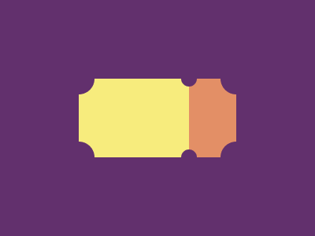

# CSS Battle #3

## [Level 19](https://cssbattle.dev/play/19)


| Character count | Score |
| --- | --- |
| 191 | 664.78 |

```html
<style>&{background:#0B2429;*{background:#F3AC3C;rotate:45deg;margin:75 125;border:solid;border-width:50px 0 0 50px;border-color:1A4341#998235;clip-path:polygon(-66%0,100%166%,166%100%,0-66%)
```

## [Level 20](https://cssbattle.dev/play/20)


| Character count | Score |
| --- | --- |
| 203 | 657.78 |

```html
<style>&{background:0 25%/25ch 75pt radial-gradient(1q,#62306D 5vw,#0000),70%25%/25ch 75pt radial-gradient(1q,#62306D 10px,#0000),50%/50%75pt linear-gradient(90deg,#F7EC7D 35vw,#E38F66 0)no-repeat#62306D
```
