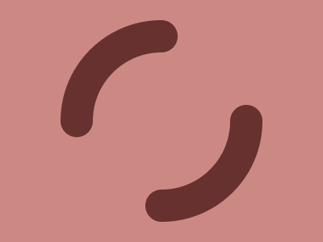

# CSS Battle #38

## [Level 251](https://cssbattle.dev/play/251)


| Character count | Score |
| --- | --- |
| 266 | 631.7 |

```html
<style>&{--b:conic-gradient(#21658A)no-repeat 50%;background:conic-gradient(#5DBCF9)no-repeat 50% 20px/20px 110px,var(--b)210px/180px 60px,var(--b)170px/140px 40px,var(--b)150px/100px 20px,var(--b)80px/100px 50px,radial-gradient(1q at 50% 80px,#21658A 50px,#5DBCF9);
```

## [Level 252](https://cssbattle.dev/play/252)


| Character count | Score |
| --- | --- |
| 137 | 708.39 |

```html
<style>&{background:radial-gradient(1q,#0000 42q,#294C0E 0 63q,#0000 0 95q,#294C0E 0 116q,#6BCF87),linear-gradient(#294C0E 50%,#6BCF87 0)
```

## [Level 253](https://cssbattle.dev/play/253)


| Character count | Score |
| --- | --- |
| 239 | 641 |

```html
<style>&{background:-10px/210px radial-gradient(1q,#66312E 20px,#0000),0 150px/100% 210px radial-gradient(1q, #66312E 20px, #0000),radial-gradient(1q,#CC8984 85px,#0000 0 125px,#CC8984),repeating-conic-gradient(#CC8984 0 25%,#66312E 0 50%)
```
